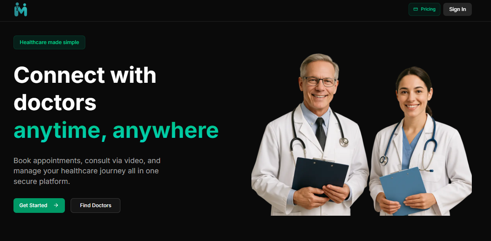
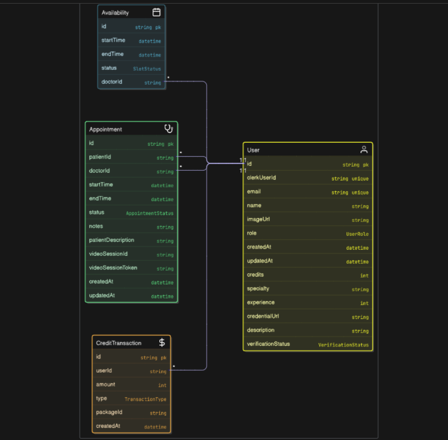

# 🩺 MediMeet - Scalable Doctor Appointment Platform

**MediMeet** is a modern, scalable doctor appointment platform built using Next.js, Tailwind CSS, Clerk, Prisma, and shadcn/ui. It delivers a seamless experience for Admins, Doctors, and Patients, each with tailored role-based interfaces, dynamic scheduling, and secure authentication.

MediMeet also features integrated video consultations powered by Vonage (OpenTok), enabling real-time, in-browser video calling between doctors and patients - all within a clean, responsive interface.


---

## 🖼️ Preview

  

---

## 🔗 Live Demo : [View Live Demo](medimeet-smr.vercel.app)  


---


## 🚀 Features

- 🔐 **Authentication** via Clerk with protected routes and role-based redirects  
- 🧑‍⚕️ **User Roles**: Admin, Doctor and Patient with specific dashboards and permissions  
- 📅 **Appointment Management** for patients and doctors  
- 🧭 **Dynamic Navigation** based on user role and auth state  
- 🧩 **Reusable Components** with responsive design and dark theme  
- ⚙️ **Admin Tools** to verify doctors and manage system status  
- 🛠️ **Custom Onboarding Flow** and verification process  
- 💳 **Subscription Flow** with Clerk checkout and credit allocation  
- ✅ **Form validation** using Zod
- 📞 **Vonage Video Calling Integration**  

---

## 🧩 Tech Stack

### 🧑‍💻 Client

- [Next.js](https://nextjs.org/)
- [Tailwind CSS](https://tailwindcss.com/)
- [Clerk](https://clerk.dev/) – Authentication & user management  
- [Lucide Icons](https://lucide.dev/) – Icon library  
- [Sonner (Toast Notifications)](https://sonner.emilkowal.ski/) – User feedback and alerts  

### ⚙️ Server

- [Node.js](https://nodejs.org/)
- [Prisma](https://www.prisma.io/) – ORM for PostgreSQL  
- [Next.js API Routes](https://nextjs.org/docs/api-routes/introduction)  
- [Zod](https://zod.dev/) – Schema validation  
- [Vonage Video API (OpenTok)](https://www.vonage.com/communications-apis/video/) – Real-time video consultations  

### Database
- [NEON PostgreSQL](https://neon.tech/) – Scalable, serverless PostgreSQL for modern apps

---


## 🗂 Project ER Diagram

The following Entity-Relationship (ER) diagram outlines the core database relationships in MediMeet:



---

## <a name="getting-started">🚀 Getting Started</a>

To get started follow these steps:

## Cloning the Repository

Using CLI

```bash
git clone https://github.com/smRid/Doctors-Appointment-Platform
```

**\*\*_Ensure you have installed [Git](https://git-scm.com) on your machine._**

or using GitHub:

-   Go to the project [repository](https://github.com/smRid/Doctors-Appointment-Platform) on my GitHub page
-   Click on the green button on the top 👆
-   Click Download ZIP


### ⚙️ Installation

## Setup .env file
```bash
NEXT_PUBLIC_CLERK_PUBLISHABLE_KEY=
CLERK_SECRET_KEY=

NEXT_PUBLIC_CLERK_SIGN_IN_URL=/sign-in
NEXT_PUBLIC_CLERK_SIGN_UP_URL=/sign-up
NEXT_PUBLIC_CLERK_AFTER_SIGN_IN_URL=/onboarding 
NEXT_PUBLIC_CLERK_AFTER_SIGN_UP_URL=/onboarding 

DATABASE_URL=

NEXT_PUBLIC_VONAGE_APPLICATION_ID=
VONAGE_PRIVATE_KEY=
```

Install the project dependencies using npm:

### Build the app

```bash
npm install
```

**\*\*_Ensure you have installed [NodeJS](https://nodejs.org/en) on your machine._**

### Generate the Prisma client and apply initial migrations

```bash
npx prisma generate
npx prisma migrate dev --name init
```
### Start the app

```bash
npm run dev
```

**\*\*_Navigate to http://localhost:3000 in your browser to access the local development server._**

